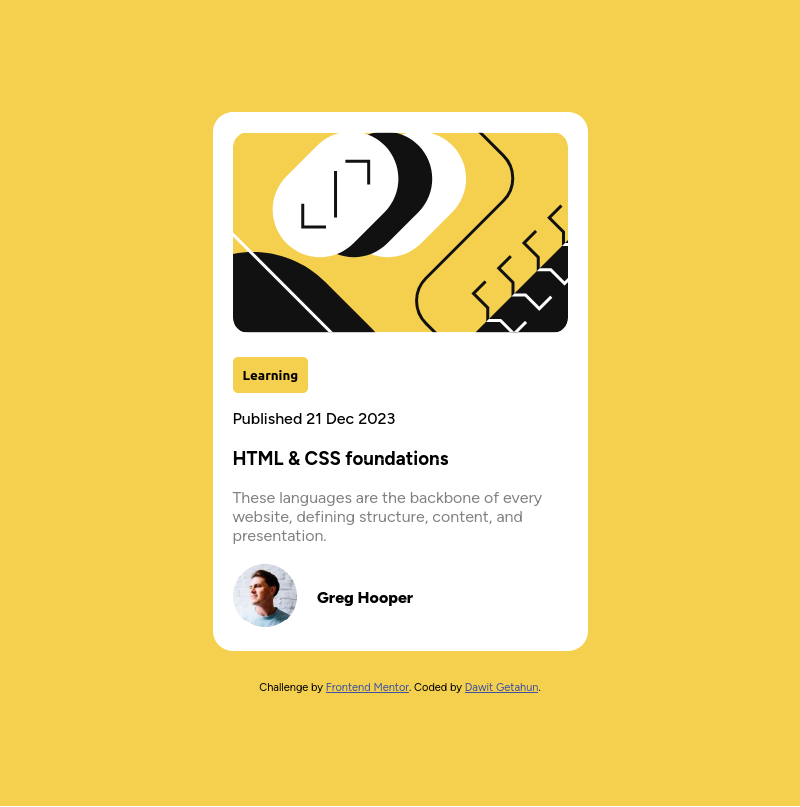
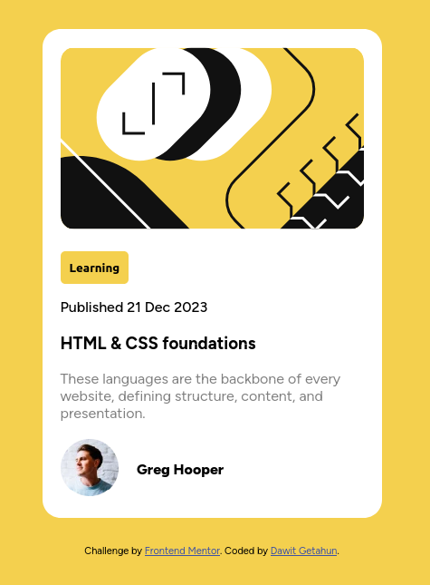

# Frontend Mentor - Blog preview card solution

This is a solution to the [Blog preview card challenge on Frontend Mentor](https://www.frontendmentor.io/challenges/blog-preview-card-ckPaj01IcS). Frontend Mentor challenges help you improve your coding skills by building realistic projects. 

## Table of contents

- [Overview](#overview)
  - [The challenge](#the-challenge)
  - [Screenshot](#screenshot)
  - [Links](#links)
- [My process](#my-process)
  - [Built with](#built-with)
  - [What I learned](#what-i-learned)
  - [Continued development](#continued-development)
  - [Useful resources](#useful-resources)
- [Author](#author)
- [Acknowledgments](#acknowledgments)

**Note: Delete this note and update the table of contents based on what sections you keep.**

## Overview

Welcome to my Blog Preview Card Website! This project showcases a blog preview card, designed to provide a visually appealing and informative snapshot of blog posts. A card highlighting essential details such as the title, a brief description, and an eye-catching image, making it easy for visitors to explore your content.

### The challenge

Users should be able to:

- See hover and focus states for all interactive elements on the page

### Screenshot

Desktop-Design
Mobile-Design

### Links

- Solution URL: [Add solution URL here](https://github.com/dawitgetahun055/blog-preview-card-main)
- Live Site URL: [Add live site URL here](https://your-live-site-url.com)

## My process

1. Analyzing the design.
2. Building the HTML structure
3. Styling With CSS 
4. Adding Responsive Design
5. Testing and Refinement
6. Documentation (detailed README about the project detail)

### Built with

- Semantic HTML5 markup
- CSS custom properties
- Flexbox
- CSS Grid
- Mobile-first workflow

**Note: These are just examples. Delete this note and replace the list above with your own choices**


### What I Learned

This project enhanced my front-end development skills by improving my understanding of HTML semantics and creative CSS styling techniques. I learned how to effectively integrate SVGs, adding a modern touch to the design. Additionally, I applied principles of visual hierarchy and accessibility to create a visually appealing and user-friendly experience.

```html
<div class="card-details">
      <button>Learning</button>
      
      <p class="Date">Published 21 Dec 2023</p>
      
      <h3>HTML & CSS foundations</h3>
      
      <p class="card-Description">These languages are the backbone of every website, defining structure, content, and presentation.</p>

      <div class="person-info">
        
        <span>Greg Hooper</span>
        
      </div>
```
```css
body {
    margin: 0;
    padding: 0;
    height: 130vh;
    display: flex;
    flex-direction: column;
    justify-content: center;
    align-items: center;
    background-color: var(--Yellow);
    box-sizing: border-box;
    font-family: "Figtree";
}

.container {
    background-color: var(--White);
    width: 375px;
    border-radius: 20px;
}
```


### Continued development

In the future I would like to 

- Learn react and other libraries
- How to apply 3D effects on websies
- work on some other projects to hone my web development skill

### Useful resources

- [mozilla.org] (https://www.mozilla.org) - Great resource for revisiting basic concepts and where you can visually see the effects of your css styles.

- [freecodecamp] (https://www.freecodecamp.org/) - helps to learn by actually engaging on projects apart from Frontend Mentor.

## Author

- Dawit Getahun
- Frontend Mentor - [@dawitgetahun055](https://www.frontendmentor.io/profile/yourusername)

## Acknowledgments

I'd like to thank [Frontend Mentor](https://www.frontendmentor.io/home) for provind us this learning opportunity along with the assets and desings we need. 

I'd also like to thank peers that helped me through my jourey in learning front-end

I'd like to thank for people who made this resources open for every one.
